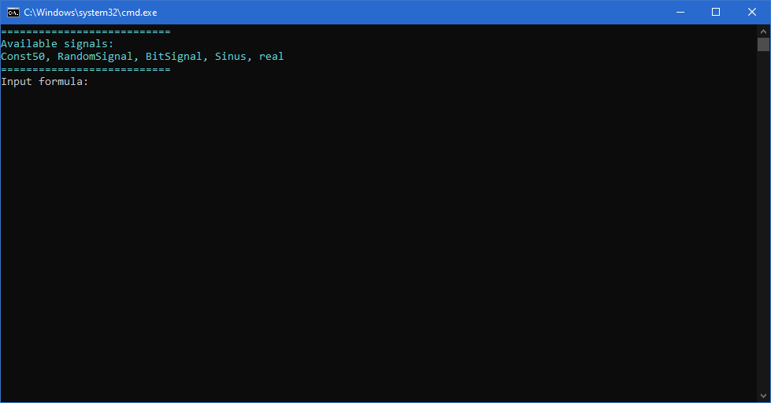
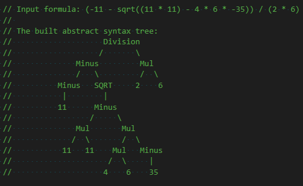

# FormulaParser
A C# console application prototype for evaluating expressions at runtime.

It tokenizes, parses and interprets the input string, and gives a single number or an array of numbers (Signal) back as a result.

## Demo

## How does it work?

  1. The input formula gets tokenized.
	
    Input: "5 * 3 + 1"
    Tokens: {{5}, {*}, {3}, {+}, {1}}

  2. An Abstract Syntax Tree is built from the tokens.

    Tokens: {{5}, {*}, {3}, {+}, {1}}
    Tree:
          +
         / \
        *   1
       / \
      5   3

  3. The Abstract Syntax Tree is interpreted. 
  The tree is traversed in Depth First Traversal and it is evaluated in that order.

    Tree:
        +
       / \
      *   1
     / \
    5   3

    1st evaluation:
      *
     / \     -> 15
    5   3
    
    2nd evaluation:
      +
     / \     -> 16
    15  1

## References
  <https://en.wikipedia.org/wiki/Context-free_grammar>

  <https://en.wikipedia.org/wiki/Abstract_syntax_tree>
  	
  <https://en.wikipedia.org/wiki/Arity>